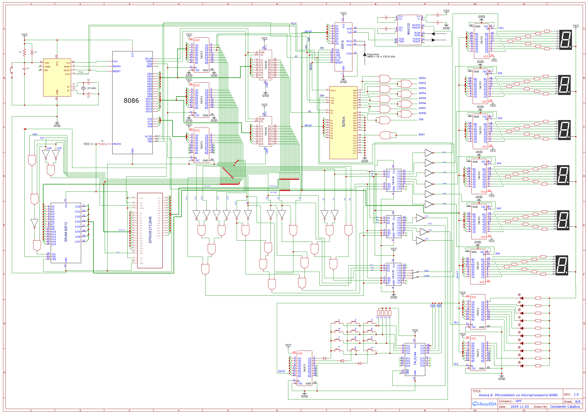

# Microsistem cu Microprocesorul 8086

## Descriere generală
Proiect realizat în cadrul disciplinei *Proiectarea cu Microprocesoare*. 
Acesta prezintă un microsistem controlat de microprocesorul **Intel 8086**, 
cu componente hardware specifice și rutine software scrise în limbaj de asamblare.

## Structura hardware

- **Microprocesor**: Intel 8086  
- **Memorie**:  
  - 256 KB EPROM (27C2048)  
  - 64 KB SRAM (62512)  
- **Interfețe**:  
  - Serială: 8251 la `0AF0H–0AF2H` sau `0BF0H–0BF2H` (selectată cu S1)  
  - Paralelă: 8255 la `0D70H–0D76H` sau `0C70H–0C76H` (selectată cu S2)  
- **Periferice**:  
  - Minitastatură cu 12 contacte  
  - 10 LED-uri  
  - Afișaj 6×7 segmente

 ## Funcționalitate software

Toate subrutinele sunt implementate în **ASM (Intel syntax)**:
- Configurare 8251  
- Configurare 8255  
- Emisie/recepție prin interfață serială (8251)  
- Emisie caracter prin interfață paralelă (8255)  
- Scanare minitastatură  
- Control LED-uri  
- Afișare hexadecimal pe 7 segmente

## Schema hardware a microsistemului

## Licență
Acest proiect este licențiat sub Licența MIT.
